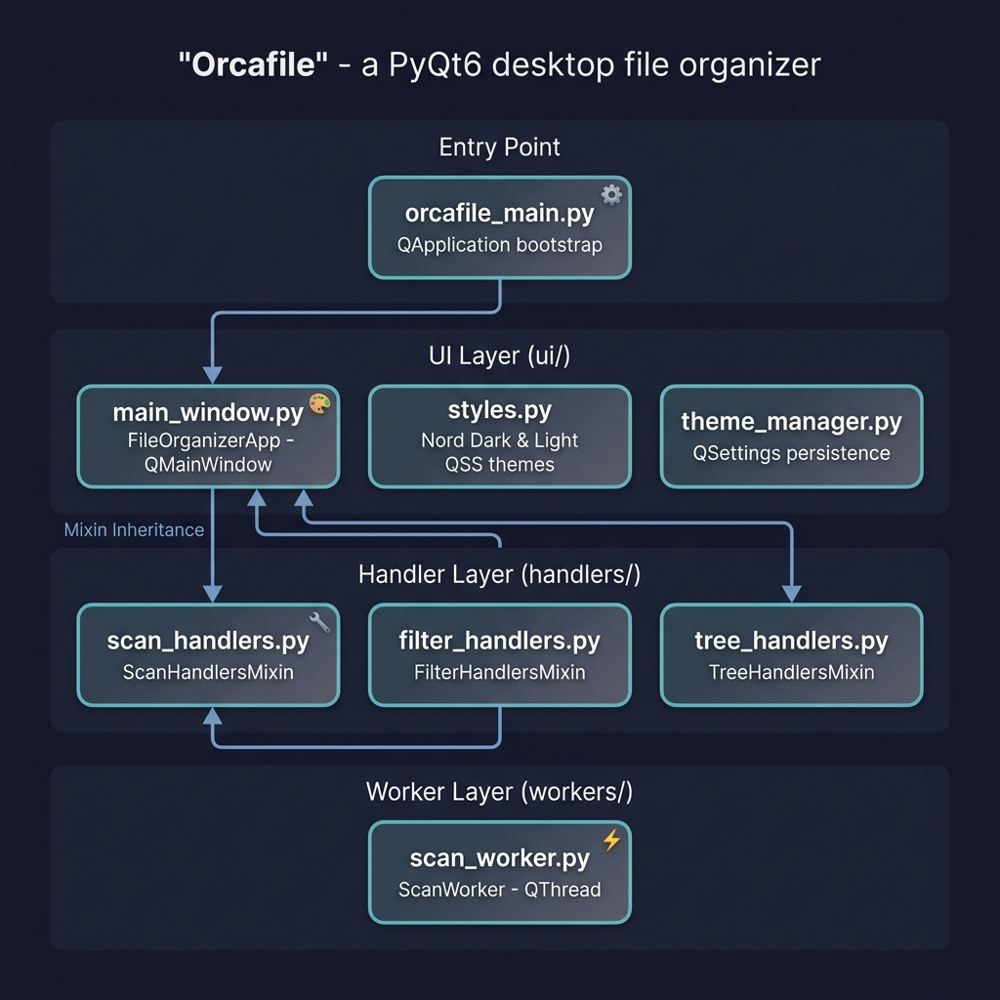
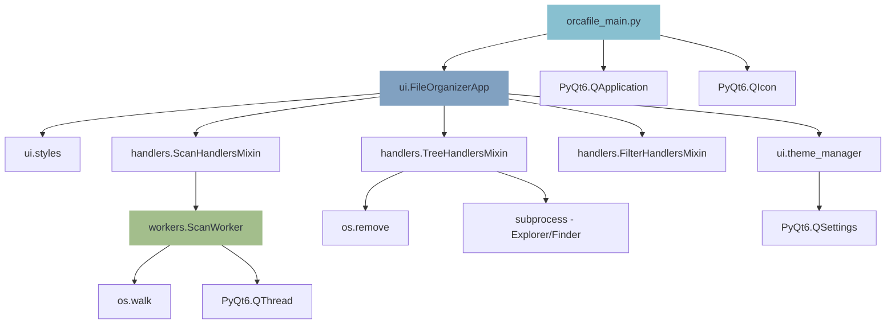
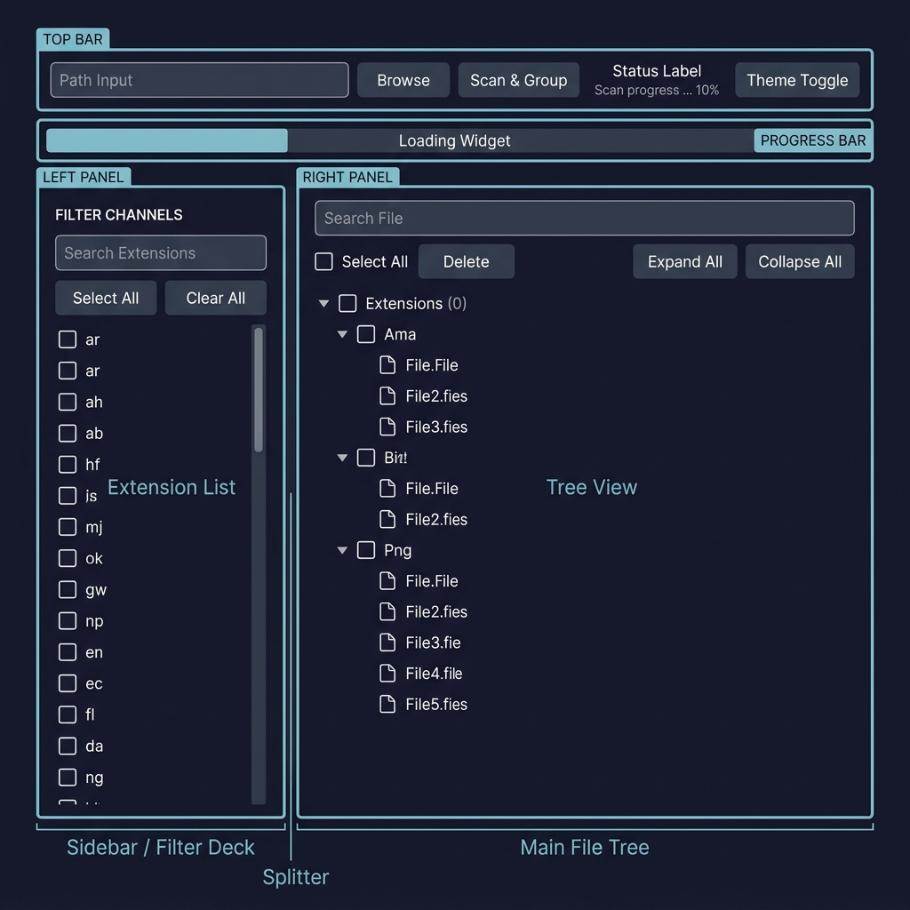
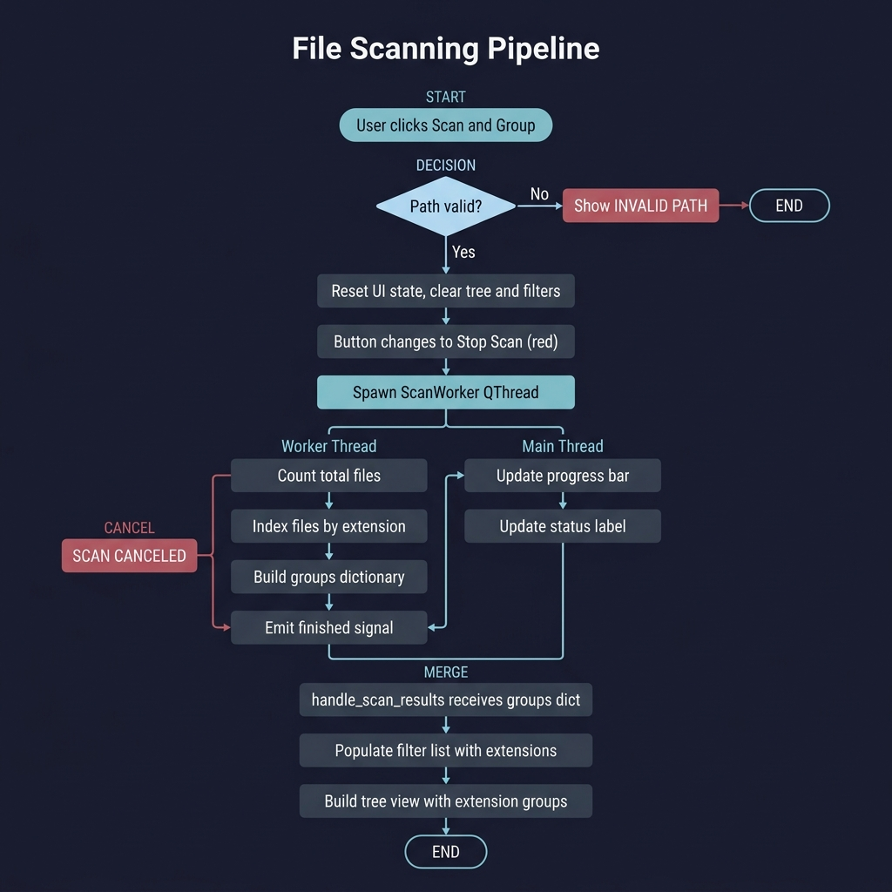
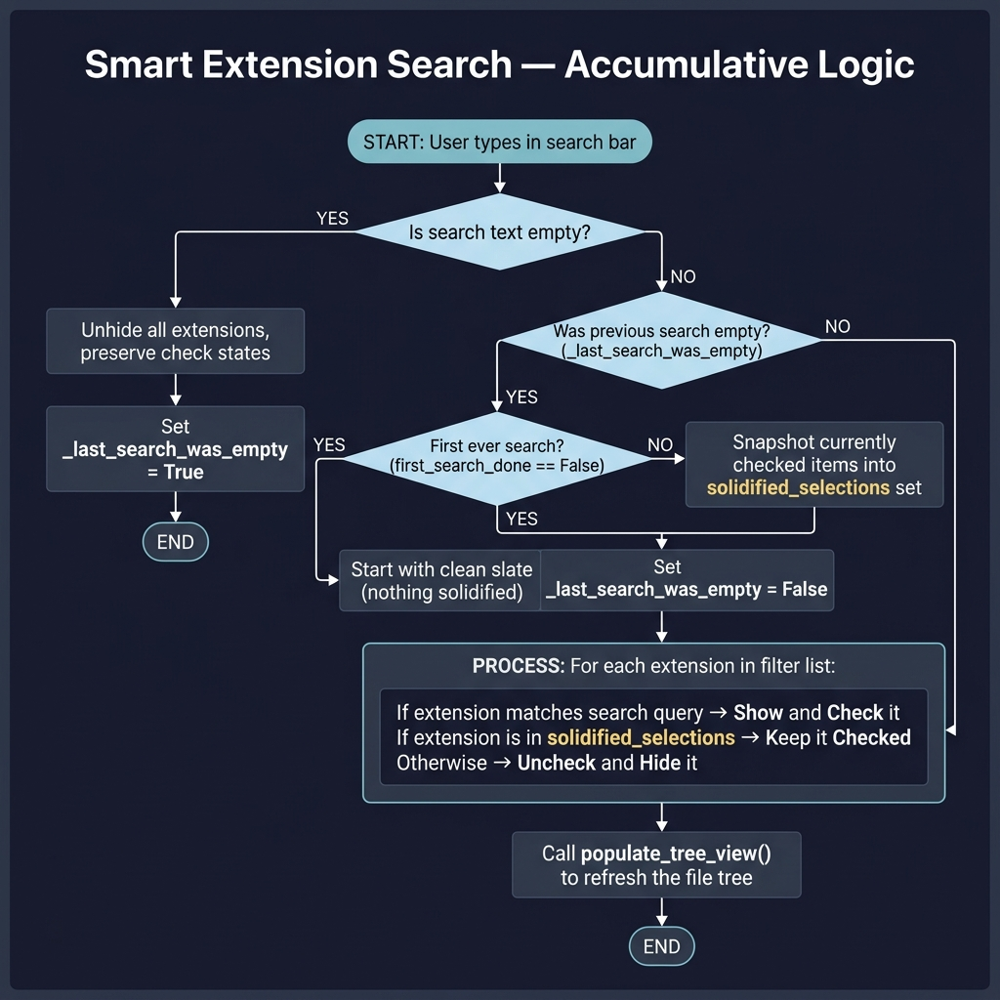
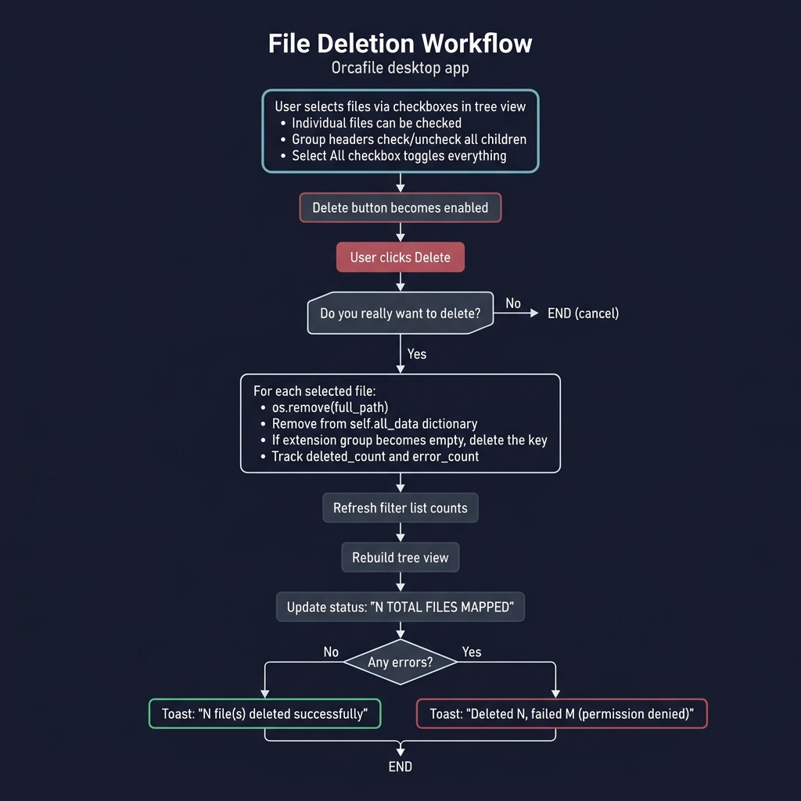
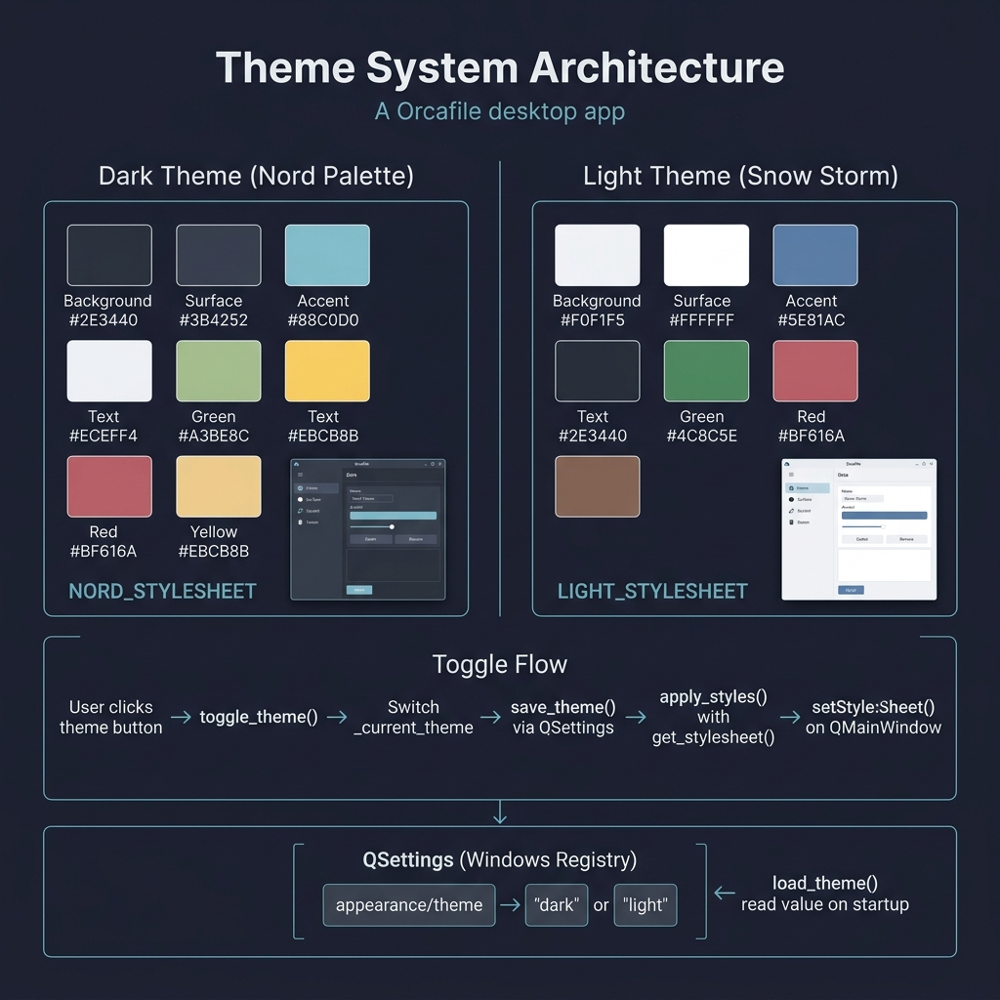

<p align="center">
  
</p>

<h1 align="center">Orcafile v1.0.1 — Technical Documentation</h1>

<p align="center">
  <b>A fast, lightweight desktop application that scans any folder or drive and instantly groups every file by its extension.</b>
</p>

<p align="center">
  
  
  
  
</p>

---

## 📖 Table of Contents

- [1. Project Overview](#1-project-overview)
- [2. Architecture Overview](#2-architecture-overview)
  - [2.1 Layered Architecture Diagram](#21-layered-architecture-diagram)
  - [2.2 Directory Structure](#22-directory-structure)
  - [2.3 Module Dependency Graph](#23-module-dependency-graph)
  - [2.4 Mixin Composition Pattern](#24-mixin-composition-pattern)
- [3. UI Layout & Widget Map](#3-ui-layout--widget-map)
- [4. Technology Stack](#4-technology-stack)
- [5. Application Entry Point](#5-application-entry-point)
- [6. Feature Deep Dives](#6-feature-deep-dives)
  - [Feature 1 — Drive/Folder Scanning & Extension Grouping](#feature-1--drivefolder-scanning--extension-grouping)
  - [Feature 2 — Extension Filter Selection](#feature-2--extension-filter-selection)
  - [Feature 3 — Open File Location (Double-Click)](#feature-3--open-file-location-double-click)
  - [Feature 4 — File Name Search](#feature-4--file-name-search)
  - [Feature 5 — Multi-Select & Bulk Delete](#feature-5--multi-select--bulk-delete)
  - [Feature 6 — Dark / Light Theme Toggle](#feature-6--dark--light-theme-toggle)
- [7. Data Structures & State Management](#7-data-structures--state-management)
- [8. Styling System](#8-styling-system)
- [9. Toast Notification System](#9-toast-notification-system)
- [10. Build & Distribution Pipeline](#10-build--distribution-pipeline)
- [11. Cross-Platform Considerations](#11-cross-platform-considerations)

---

## 1. Project Overview

**Orcafile** is a desktop file organizer built with **Python 3.10+** and **PyQt6**. It recursively scans any directory or drive, indexes every file, and groups them by file extension into an interactive, searchable tree view. The application is designed to help users quickly locate, filter, and manage files scattered across large directory trees.

### Core Features at a Glance

| # | Feature | Description |
|---|---------|-------------|
| 1 | **Drive/Folder Scanning** | Select any folder or drive; files are recursively scanned and grouped by extension |
| 2 | **Extension Filter Selection** | Sidebar with checkable extension list to control which groups appear in the tree |
| 3 | **Open File Location** | Double-click any file to open its parent folder in Windows Explorer / Finder |
| 4 | **File Name Search** | Real-time search across all indexed file names to find specific files |
| 5 | **Multi-Select & Bulk Delete** | Select multiple files via checkboxes and delete them with confirmation |
| 6 | **Dark / Light Theme Toggle** | Switch between Nord dark and Snow Storm light themes with persistent preference |

---

## 2. Architecture Overview

Orcafile follows a **layered architecture** with clear separation of concerns using Python's **mixin inheritance pattern**. The codebase is organized into four distinct layers:

### 2.1 Layered Architecture Diagram

<p align="center">
  
</p>


### 2.2 Directory Structure

```
orcafile_v1.0.1/
├── orcafile_main.py          # Application entry point
├── orcafile_logo.ico         # Application icon (taskbar & title bar)
├── check.svg                 # Checkbox "checked" indicator icon
├── dash.svg                  # Checkbox "indeterminate" indicator icon
├── build_executable.bat      # PyInstaller build script
├── orcafile_main.spec        # PyInstaller spec configuration
├── LICENSE                   # GPLv3 license
├── README.MD                 # User-facing readme
├── CREDITS.MD                # Third-party credits
│
├── ui/                       # UI Layer — presentation & styling
│   ├── __init__.py           #   Exports: FileOrganizerApp
│   ├── main_window.py        #   Main window class (239 lines)
│   ├── styles.py             #   Dark & Light QSS stylesheets (281 lines)
│   └── theme_manager.py      #   Theme persistence via QSettings (19 lines)
│
├── handlers/                 # Handler Layer — business logic mixins
│   ├── __init__.py           #   Exports: ScanHandlersMixin, FilterHandlersMixin, TreeHandlersMixin
│   ├── scan_handlers.py      #   Scan start/stop/results (117 lines)
│   ├── filter_handlers.py    #   Extension filter logic (69 lines)
│   └── tree_handlers.py      #   Tree view operations & deletion (248 lines)
│
├── workers/                  # Worker Layer — background threads
│   ├── __init__.py           #   Exports: ScanWorker
│   └── scan_worker.py        #   Background file scanner (59 lines)
│
├── setup/                    # Installer configuration
│   ├── inno_setup.iss        #   Inno Setup installer script
│   ├── orcafile_setup.exe    #   Pre-built Windows installer
│   ├── CREDITS.txt           #   Credits bundled with installer
│   └── FROM-DEVELOPER.txt    #   Developer note shown post-install
│
├── docs/                     # Documentation assets
│   └── orcafile_v1.0.1_snapshot.png
│
├── build/                    # PyInstaller build output
└── dist/                     # PyInstaller distribution output
```

### 2.3 Module Dependency Graph



### 2.4 Mixin Composition Pattern

Orcafile uses **multiple inheritance with mixins** to decompose a single large window class into focused, maintainable units. The `FileOrganizerApp` class inherits from:

```python
class FileOrganizerApp(ScanHandlersMixin, FilterHandlersMixin, TreeHandlersMixin, QMainWindow):
```

| Mixin | Responsibility | Key Methods |
|-------|---------------|-------------|
| `ScanHandlersMixin` | Scan lifecycle (start, stop, progress, results) | `start_scan()`, `stop_scan()`, `handle_scan_results()` |
| `FilterHandlersMixin` | Extension sidebar filtering with accumulative search | `filter_extension_list()`, `toggle_all_filters()` |
| `TreeHandlersMixin` | Tree view rendering, checkbox logic, file search, deletion, open location | `populate_tree_view()`, `confirm_and_delete_selected()`, `open_file_location()` |
| `QMainWindow` | Base PyQt6 window class | Inherited from Qt framework |

**Why Mixins?** Each mixin accesses `self` (the `FileOrganizerApp` instance) and its widgets directly. This avoids complex signal-slot wiring between separate objects while keeping each handler file focused on a single responsibility. The `__init__` is defined only in `FileOrganizerApp`, which calls `super().__init__()` once via Python's MRO (Method Resolution Order).

```
Method Resolution Order:
  FileOrganizerApp
  → ScanHandlersMixin
  → FilterHandlersMixin
  → TreeHandlersMixin
  → QMainWindow
  → QWidget
  → QObject
```

---

## 3. UI Layout & Widget Map

<p align="center">
  
</p>

The window is divided into three logical zones:

### Top Control Deck


| Widget | Variable Name | Qt Type | Purpose |
|--------|--------------|---------|---------|
| Path input | `self.path_input` | `QLineEdit` | User enters or browses for a folder path |
| Browse button | `browse_btn` | `QPushButton` | Opens native folder picker dialog |
| Scan button | `self.scan_btn` | `QPushButton` | Starts scan (toggles to "Stop Scan" during scan) |
| Status label | `self.top_stats_label` | `QLabel` | Shows: SYSTEM IDLE → SCANNING: X% → N TOTAL FILES MAPPED |
| Theme button | `self.theme_btn` | `QPushButton` | Toggles ☀️ / 🌙 between dark and light themes |
| Progress bar | `self.progress_bar` | `QProgressBar` | Animated indeterminate → determinate during scan |

### Main Split Layout (QSplitter — Horizontal)

| Panel | Key Widgets | Purpose |
|-------|------------|---------|
| **Left Sidebar** | `self.filter_list` (`QListWidget`) | Extension filter with checkboxes + search |
| **Right Content** | `self.tree_view` (`QTreeWidget`) | Hierarchical file tree with checkboxes |
| **Splitter** | `QSplitter` (handle width: 12px) | Resizable divider at sizes [260, 840] |

---

## 4. Technology Stack

| Component | Technology | Version | Purpose |
|-----------|-----------|---------|---------|
| Language | Python | 3.10+ | Core application logic |
| GUI Framework | PyQt6 | 6.x | Widgets, event loop, threading |
| Background Threading | `QThread` | (from PyQt6) | Non-blocking file scanning |
| Theme Persistence | `QSettings` | (from PyQt6) | Stores theme preference in Windows Registry |
| Stylesheet Engine | QSS (Qt Style Sheets) | — | CSS-like styling for all widgets |
| Build Tool | PyInstaller | — | Compiles Python to standalone `.exe` |
| Installer | Inno Setup | — | Creates Windows installer (`orcafile_setup.exe`) |
| License | GPLv3 | — | Open source license |

**External Dependencies:** Only **PyQt6** — the application has zero other pip dependencies.

---

## 5. Application Entry Point

**File:** `orcafile_main.py` (21 lines)

```python
import sys
import platform

from PyQt6.QtGui import QIcon
from PyQt6.QtWidgets import QApplication

from ui import FileOrganizerApp


if __name__ == "__main__":
    # Windows-specific: Set AppUserModelID so the taskbar icon works correctly
    if platform.system() == "Windows":
        import ctypes
        myappid = 'shayansaha85.orcafile.fileorganizer.1.0'
        ctypes.windll.shell32.SetCurrentProcessExplicitAppUserModelID(myappid)

    app = QApplication(sys.argv)
    app.setWindowIcon(QIcon("orcafile_logo.ico"))

    window = FileOrganizerApp()
    window.show()
    sys.exit(app.exec())
```

### Startup Sequence

```
1. Platform check → Set Windows AppUserModelID (for taskbar grouping)
2. Create QApplication → Initialize Qt event loop
3. Set global window icon from orcafile_logo.ico
4. Instantiate FileOrganizerApp:
   a. super().__init__() → QMainWindow init
   b. Initialize state: all_data={}, worker=None, search state vars
   c. Load saved theme via load_theme() → QSettings read
   d. init_ui() → Build all widgets and layouts
   e. apply_styles() → Apply QSS stylesheet for current theme
5. window.show() → Display the window
6. app.exec() → Enter Qt event loop (blocking until window closes)
```

---

## 6. Feature Deep Dives

---

### Feature 1 — Drive/Folder Scanning & Extension Grouping

> **Summary:** The user selects a drive or folder, and Orcafile recursively scans the entire directory tree using `os.walk()`. Every file is grouped by its extension into a dictionary, which is then rendered as a tree view and filter sidebar.

#### Architecture Diagram — Scan Pipeline

<p align="center">
  
</p>

#### Files Involved

| File | Class/Function | Role |
|------|---------------|------|
| `ui/main_window.py` | `FileOrganizerApp.browse_folder()` | Opens `QFileDialog` to pick a directory |
| `ui/main_window.py` | `FileOrganizerApp.init_ui()` | Creates path input, browse button, scan button |
| `handlers/scan_handlers.py` | `ScanHandlersMixin` | Manages entire scan lifecycle |
| `workers/scan_worker.py` | `ScanWorker` | Background thread that does the actual scanning |

#### How It Works — Step by Step

**Step 1: User Selects a Path**

The user either types a path into `path_input` or clicks the **Browse** button:

```python
# ui/main_window.py — line 185
def browse_folder(self):
    selected_dir = QFileDialog.getExistingDirectory(self, "Open Folder Location")
    if selected_dir:
        self.path_input.setText(selected_dir)
```

**Step 2: User Clicks "Scan & Group"**

The button's click signal is connected to `handle_scan_click()`:

```python
# handlers/scan_handlers.py — line 12
def handle_scan_click(self):
    if self.worker and self.worker.isRunning():
        self.stop_scan()    # If already scanning → stop
    else:
        self.start_scan()   # Otherwise → start
```

**Step 3: Start Scan**

`start_scan()` validates the path, resets UI state, and spawns a `ScanWorker` thread:

```python
# handlers/scan_handlers.py — line 18
def start_scan(self):
    target_dir = self.path_input.text()
    if not target_dir or not os.path.exists(target_dir):
        self.top_stats_label.setText("INVALID PATH")
        return

    # Reset accumulative search state
    self.first_search_done = False
    self.solidified_selections = set()
    self._last_search_was_empty = True

    # Visual reset
    self.loading_widget.show()
    self.tree_view.clear()
    self.filter_list.clear()

    # Toggle button to "Stop Scan" (red styling)
    self.scan_btn.setText("Stop Scan")
    self.scan_btn.setObjectName("StopButton")
    self.apply_styles()

    # Spawn background worker
    self.worker = ScanWorker(target_dir)
    self.worker.status.connect(self.handle_worker_status)
    self.worker.progress.connect(self.handle_worker_progress)
    self.worker.finished.connect(self.handle_scan_results)
    self.worker.start()
```

**Step 4: Background Scanning (ScanWorker — QThread)**

The `ScanWorker` runs on a separate thread to avoid freezing the UI. It performs **two passes** over the directory tree:

```python
# workers/scan_worker.py
class ScanWorker(QThread):
    finished = pyqtSignal(dict)       # Emits the final groups dict
    progress = pyqtSignal(int, int)   # Emits (current, total) counts
    status = pyqtSignal(str)          # Emits status messages

    def run(self):
        # ── PASS 1: Count total files ──
        self.status.emit("CALCULATING TOTAL SIZE...")
        total_files = 0
        for root, _, files in os.walk(self.target_dir):
            if not self._is_running:
                return
            total_files += len(files)

        # ── PASS 2: Index files by extension ──
        self.status.emit("INDEXING...")
        groups = {}
        processed_files = 0

        for root_path, _, files in os.walk(self.target_dir):
            if not self._is_running:
                break
            for file in files:
                if not self._is_running:
                    break
                full_path = os.path.join(root_path, file)
                _, ext = os.path.splitext(file)
                ext = ext.lower().strip() if ext else "no extension"

                if ext not in groups:
                    groups[ext] = []
                groups[ext].append((file, full_path))

                processed_files += 1
                if processed_files % 100 == 0 or processed_files == total_files:
                    self.progress.emit(processed_files, total_files)

        self.finished.emit(groups if self._is_running else {})
```

**Key Design Decisions:**

| Decision | Rationale |
|----------|-----------|
| **Two-pass approach** | Pass 1 counts files to enable a determinate progress bar; Pass 2 performs the actual indexing |
| **Progress every 100 files** | Avoids flooding the main thread with signals while keeping the UI responsive |
| **`_is_running` flag** | Cooperative cancellation — checked at every loop iteration for fast response to "Stop" |
| **`os.walk()` usage** | Recursively traverses the entire directory tree including all subdirectories |
| **Extension normalization** | `ext.lower().strip()` ensures `.PDF` and `.pdf` are grouped together |

**Step 5: Results Arrive on Main Thread**

When the worker finishes, `handle_scan_results()` processes the groups dictionary:

```python
# handlers/scan_handlers.py — line 73
def handle_scan_results(self, groups):
    self.all_data = groups  # Store globally for all features to access

    # Populate sidebar with extension checkboxes
    for ext, files in sorted(groups.items()):
        item = QListWidgetItem(f" {ext}  ({len(files)})")
        item.setFlags(item.flags() | Qt.ItemFlag.ItemIsUserCheckable)
        item.setCheckState(Qt.CheckState.Checked)  # All checked by default
        self.filter_list.addItem(item)

    self.populate_tree_view()  # Build the tree (see Feature 2)
    self.top_stats_label.setText(f"{total_files} TOTAL FILES MAPPED")
```

**Step 6: Cancel (Optional)**

If the user clicks "Stop Scan" mid-scan:

```python
# handlers/scan_handlers.py — line 48
def stop_scan(self):
    if self.worker and self.worker.isRunning():
        self.worker.stop()    # Sets _is_running = False
        self.worker.wait()    # Blocks until thread finishes
    self.loading_widget.hide()
    self.reset_scan_button()
    self.top_stats_label.setText("SCAN CANCELED")
```

#### Data Flow Diagram

```
User Input                  Main Thread                    Worker Thread
─────────                   ───────────                    ─────────────
path_input.text() ─────────► start_scan()
                             │
                             ├── validate path
                             ├── reset UI
                             ├── create ScanWorker ───────► .start()
                             │                              │
                             │    status signal ◄───────── "CALCULATING..."
                             │    status signal ◄───────── "INDEXING..."
                             │    progress signal ◄──────── (100, 5000)
                             │    progress signal ◄──────── (200, 5000)
                             │    ...
                             │    finished signal ◄──────── {".pdf": [...], ...}
                             │
                             ├── handle_scan_results()
                             ├── populate filter_list
                             └── populate_tree_view()
```

#### Thread Safety

- All UI updates happen on the **main thread** via Qt's signal-slot mechanism
- `pyqtSignal` instances serialize data across thread boundaries safely
- The worker never directly touches any widget — it only emits signals

---

### Feature 2 — Extension Filter Selection

> **Summary:** After scanning, the left sidebar displays all discovered extensions with file counts. Users can check/uncheck extensions to control which groups appear in the tree view. A smart "accumulative search" allows isolating and building up extension selections across multiple searches.

#### Architecture Diagram — Accumulative Search Logic

<p align="center">
  
</p>

#### Files Involved

| File | Class/Function | Role |
|------|---------------|------|
| `handlers/filter_handlers.py` | `FilterHandlersMixin` | All extension filtering logic |
| `handlers/tree_handlers.py` | `TreeHandlersMixin.populate_tree_view()` | Rebuilds tree based on checked extensions |
| `ui/main_window.py` | Widget setup | `filter_list`, `search_input`, Select All / Clear All buttons |

#### How Extension Filtering Works

**The filter sidebar** is a `QListWidget` where each item represents an extension with a checkbox:

```
☑  .pdf   (5)
☑  .jpg   (12)
☐  .txt   (3)
☑  .py    (8)
```

When any checkbox changes, `update_tree_filters()` is called, which triggers `populate_tree_view()`:

```python
# handlers/tree_handlers.py — line 12
def populate_tree_view(self):
    self.tree_view.clear()

    # Collect only checked extensions
    enabled_extensions = set()
    for i in range(self.filter_list.count()):
        item = self.filter_list.item(i)
        if item.checkState() == Qt.CheckState.Checked:
            ext_name = item.text().strip().split("  (")[0]
            enabled_extensions.add(ext_name)

    # Build tree nodes only for enabled extensions
    for ext, file_list in sorted(self.all_data.items()):
        if ext not in enabled_extensions:
            continue

        parent_node = QTreeWidgetItem(self.tree_view,
            [f" {ext.upper()} Group ({len(file_list)} items)"])
        parent_node.setFlags(parent_node.flags() | Qt.ItemFlag.ItemIsUserCheckable)
        parent_node.setCheckState(0, Qt.CheckState.Unchecked)

        for name, path in file_list:
            child = QTreeWidgetItem(parent_node, [name, path])
            child.setFlags(child.flags() | Qt.ItemFlag.ItemIsUserCheckable)
            child.setCheckState(0, Qt.CheckState.Unchecked)
```

#### The Accumulative Search Algorithm

The extension search bar uses a **smart accumulative logic** that differs from a simple text filter. This allows users to build up a selection across multiple search queries.

**State Variables:**

```python
self.first_search_done = False       # Has the user ever searched?
self.solidified_selections = set()   # Extensions that were checked before the current search
self._last_search_was_empty = True   # Was the search bar empty before this keystroke?
```

**Algorithm Walkthrough:**

```python
# handlers/filter_handlers.py — line 7
def filter_extension_list(self, text):
    search_query = text.lower().strip()

    # CASE 1: User cleared the search bar
    if not search_query:
        # Unhide everything, keep check states as they are
        for i in range(self.filter_list.count()):
            self.filter_list.item(i).setHidden(False)
        self._last_search_was_empty = True
        return

    # CASE 2: Transition from empty → typing (new search session)
    if self._last_search_was_empty:
        self.solidified_selections = set()
        if not self.first_search_done:
            # Very first search ever: start with a blank slate
            self.first_search_done = True
        else:
            # Subsequent search: snapshot what's already checked
            for i in range(self.filter_list.count()):
                item = self.filter_list.item(i)
                if item.checkState() == Qt.CheckState.Checked:
                    self.solidified_selections.add(item.text())

        self._last_search_was_empty = False

    # CASE 3: Apply visibility and selection
    for i in range(self.filter_list.count()):
        item = self.filter_list.item(i)
        is_match = search_query in item.text().lower()

        item.setHidden(not is_match)

        # Check if it matches current search OR was previously solidified
        if is_match or (item.text() in self.solidified_selections):
            item.setCheckState(Qt.CheckState.Checked)
        else:
            item.setCheckState(Qt.CheckState.Unchecked)

    self.populate_tree_view()
```

**Example Usage Scenario:**

| Step | Action | Result |
|------|--------|--------|
| 1 | Scan completes | All 20 extensions checked |
| 2 | Type `.pdf` | Only `.pdf` is checked (first search — clean slate) |
| 3 | Clear search | All extensions visible, only `.pdf` remains checked |
| 4 | Type `.jpg` | `.pdf` is solidified + `.jpg` is matched → both checked |
| 5 | Clear search | Both `.pdf` and `.jpg` checked, everything visible |

#### Select All / Clear All Buttons

```python
# handlers/filter_handlers.py — line 51
def toggle_all_filters(self, state):
    for i in range(self.filter_list.count()):
        item = self.filter_list.item(i)
        if not item.isHidden():  # Only affect visible items
            item.setCheckState(state)

    # Reset search state based on action
    if state == Qt.CheckState.Checked:
        self.first_search_done = False   # "Select All" resets to fresh state
    else:
        self.first_search_done = True    # "Clear All" means next search isolates
```

---

### Feature 3 — Open File Location (Double-Click)

> **Summary:** Double-clicking any file entry in the tree view opens that file's parent directory in the native file manager with the file pre-selected.

#### Files Involved

| File | Class/Function | Role |
|------|---------------|------|
| `handlers/tree_handlers.py` | `TreeHandlersMixin.open_file_location()` | Handles the double-click event |
| `ui/main_window.py` | Signal connection | `tree_view.itemDoubleClicked.connect(self.open_file_location)` |

#### How It Works

```python
# handlers/tree_handlers.py — line 233
def open_file_location(self, item, column):
    file_path = item.text(1)  # Column 1 = "Target Destination Path"
    if not file_path or not os.path.exists(file_path):
        return

    current_os = platform.system()
    try:
        if current_os == "Windows":
            # /select, flag highlights the specific file in Explorer
            subprocess.run(["explorer", "/select,", os.path.normpath(file_path)])
        elif current_os == "Darwin":
            subprocess.run(["open", "-R", file_path])
        else:
            subprocess.run(["xdg-open", os.path.dirname(file_path)])
    except Exception:
        self.top_stats_label.setText("EXPLORER ERROR")
```

**Cross-Platform Behavior:**

| OS | Command | Behavior |
|----|---------|----------|
| **Windows** | `explorer /select, C:\path\to\file.pdf` | Opens Explorer with the file highlighted |
| **macOS** | `open -R /path/to/file.pdf` | Opens Finder with the file revealed |
| **Linux** | `xdg-open /path/to/` | Opens the directory in the default file manager |

**Safety Guards:**
- Checks that `file_path` is not empty (parent group nodes have no path in column 1)
- Checks `os.path.exists()` before attempting to open
- Catches any `Exception` to prevent crashes — shows "EXPLORER ERROR" in the status bar

**Signal Connection:**
```python
# ui/main_window.py — line 176
self.tree_view.itemDoubleClicked.connect(self.open_file_location)
```

The `itemDoubleClicked` signal passes the clicked `QTreeWidgetItem` and column index. Group-level items (parents) have no path in column 1, so double-clicking them is a no-op.

---

### Feature 4 — File Name Search

> **Summary:** A search bar above the tree view allows real-time filtering by file name. As the user types, only matching files remain visible; non-matching files and empty groups are hidden.

#### Files Involved

| File | Class/Function | Role |
|------|---------------|------|
| `handlers/tree_handlers.py` | `TreeHandlersMixin.filter_file_tree()` | Hides/shows tree items based on search |
| `ui/main_window.py` | Signal connection | `file_search_input.textChanged.connect(self.filter_file_tree)` |

#### How It Works

```python
# handlers/tree_handlers.py — line 209
def filter_file_tree(self, text):
    search_query = text.lower().strip()

    for i in range(self.tree_view.topLevelItemCount()):
        group_item = self.tree_view.topLevelItem(i)
        group_has_match = False

        for j in range(group_item.childCount()):
            file_item = group_item.child(j)
            file_name = file_item.text(0).lower()  # Column 0 = file name

            if search_query in file_name:
                file_item.setHidden(False)
                group_has_match = True
            else:
                file_item.setHidden(True)

        # Hide group if no children match (and search is active)
        if not group_has_match and search_query != "":
            group_item.setHidden(True)
        else:
            group_item.setHidden(False)
            if search_query:
                group_item.setExpanded(True)  # Auto-expand matching groups
```

**Key Behaviors:**

| Input | Effect |
|-------|--------|
| `""` (empty) | All files and groups are shown |
| `"report"` | Only files containing "report" in their name are shown; empty groups hide |
| `"main.py"` | Matches `main.py`, `main.pyc`, etc. (substring match) |

**Performance:** This operation is **O(n)** where n = total number of files in the tree. It operates on already-rendered `QTreeWidgetItem` objects using `.setHidden()`, which is a lightweight Qt call. No data structure is rebuilt — the tree is simply filtered in-place.

**Integration with Extension Filter:** When `populate_tree_view()` rebuilds the tree (e.g., after an extension filter change), it checks if a file search is active and re-applies it:

```python
# handlers/tree_handlers.py — line 41 (inside populate_tree_view)
if self.file_search_input.text():
    self.filter_file_tree(self.file_search_input.text())
```

---

### Feature 5 — Multi-Select & Bulk Delete

> **Summary:** Users can select individual files or entire extension groups using tri-state checkboxes. Selected files can be permanently deleted with a confirmation dialog. The application updates its internal state, filter counts, and tree view after deletion.

#### Architecture Diagram — Delete Workflow

<p align="center">
  
</p>

#### Files Involved

| File | Class/Function | Role |
|------|---------------|------|
| `handlers/tree_handlers.py` | `handle_tree_item_changed()` | Checkbox change propagation |
| `handlers/tree_handlers.py` | `_update_parent_check_state()` | Tri-state parent checkbox logic |
| `handlers/tree_handlers.py` | `toggle_select_all_files()` | Master "Select All" checkbox |
| `handlers/tree_handlers.py` | `get_selected_files()` | Collects all checked file-level items |
| `handlers/tree_handlers.py` | `confirm_and_delete_selected()` | Shows confirmation dialog |
| `handlers/tree_handlers.py` | `delete_selected_files()` | Performs the actual deletion |
| `handlers/scan_handlers.py` | `refresh_filter_counts()` | Updates sidebar counts after deletion |

#### Tri-State Checkbox System

The tree uses a tri-state checkbox model:

```
☐  Unchecked     — No files selected in this group
☑  Checked       — All files selected in this group
▣  Partially     — Some files selected in this group
```

**Parent → Child Propagation:**
When a group header is checked/unchecked, all its children follow:

```python
# handlers/tree_handlers.py — line 46
def handle_tree_item_changed(self, item, column):
    if self._block_tree_signals:
        return

    self._block_tree_signals = True

    if item.parent() is None:
        # Group item toggled → propagate to children
        state = item.checkState(0)
        if state != Qt.CheckState.PartiallyChecked:
            for i in range(item.childCount()):
                item.child(i).setCheckState(0, state)
    else:
        # File item toggled → update parent tri-state
        parent = item.parent()
        self._update_parent_check_state(parent)

    self._block_tree_signals = False
    self.update_delete_button_state()
    self._sync_select_all_checkbox()
```

**Child → Parent Propagation:**

```python
def _update_parent_check_state(self, parent):
    total = parent.childCount()
    checked_count = sum(
        1 for i in range(total)
        if parent.child(i).checkState(0) == Qt.CheckState.Checked
    )

    if checked_count == 0:
        parent.setCheckState(0, Qt.CheckState.Unchecked)
    elif checked_count == total:
        parent.setCheckState(0, Qt.CheckState.Checked)
    else:
        parent.setCheckState(0, Qt.CheckState.PartiallyChecked)
```

**The `_block_tree_signals` Guard:**
Without this flag, changing a parent's checkbox would trigger `itemChanged` for each child, which would trigger parent recalculation, creating an infinite recursion. The flag prevents re-entry during programmatic changes.

#### Master "Select All" Checkbox

A checkbox above the tree (`self.select_all_checkbox`) controls all visible file checkboxes:

```python
def toggle_select_all_files(self, state):
    target = Qt.CheckState.Checked if state != 0 else Qt.CheckState.Unchecked

    self._block_tree_signals = True
    for i in range(self.tree_view.topLevelItemCount()):
        group = self.tree_view.topLevelItem(i)
        if group.isHidden():
            continue    # Skip hidden groups
        group.setCheckState(0, target)
        for j in range(group.childCount()):
            child = group.child(j)
            if not child.isHidden():
                child.setCheckState(0, target)
    self._block_tree_signals = False
```

The master checkbox also syncs **upward** — when individual items change, `_sync_select_all_checkbox()` updates it:

```python
def _sync_select_all_checkbox(self):
    total = 0
    checked = 0
    for i in range(self.tree_view.topLevelItemCount()):
        group = self.tree_view.topLevelItem(i)
        for j in range(group.childCount()):
            total += 1
            if group.child(j).checkState(0) == Qt.CheckState.Checked:
                checked += 1

    if total == 0 or checked == 0:
        self.select_all_checkbox.setCheckState(Qt.CheckState.Unchecked)
    elif checked == total:
        self.select_all_checkbox.setCheckState(Qt.CheckState.Checked)
    else:
        self.select_all_checkbox.setCheckState(Qt.CheckState.PartiallyChecked)
```

#### Delete Button State

The Delete button is **disabled by default** and only becomes enabled when at least one file is selected:

```python
def update_delete_button_state(self):
    has_selection = len(self.get_selected_files()) > 0
    self.delete_btn.setEnabled(has_selection)
```

#### Deletion Process

**Step 1: Collect Selected Files**

```python
def get_selected_files(self):
    selected = []
    for i in range(self.tree_view.topLevelItemCount()):
        group = self.tree_view.topLevelItem(i)
        ext = group.text(0).strip().split(" Group")[0].strip().lower()

        for j in range(group.childCount()):
            child = group.child(j)
            if child.checkState(0) == Qt.CheckState.Checked:
                selected.append((ext, child.text(0), child.text(1)))
    return selected  # List of (extension, filename, full_path)
```

**Step 2: Confirmation Dialog**

```python
def confirm_and_delete_selected(self):
    selected = self.get_selected_files()
    if not selected:
        return

    reply = QMessageBox.question(
        self, "Confirm Deletion",
        "Do you really want to delete?",
        QMessageBox.StandardButton.Yes | QMessageBox.StandardButton.No,
        QMessageBox.StandardButton.No  # Default to "No" for safety
    )

    if reply == QMessageBox.StandardButton.No:
        return

    self.delete_selected_files(selected)
```

**Step 3: Delete Files & Update State**

```python
def delete_selected_files(self, selected):
    deleted_count = 0
    error_count = 0

    for ext, filename, full_path in selected:
        try:
            if os.path.exists(full_path):
                os.remove(full_path)           # Delete from disk
            deleted_count += 1

            # Remove from in-memory data structure
            if ext in self.all_data:
                self.all_data[ext] = [
                    (n, p) for n, p in self.all_data[ext] if p != full_path
                ]
                if not self.all_data[ext]:
                    del self.all_data[ext]      # Remove empty group

        except (PermissionError, OSError):
            error_count += 1

    # Refresh UI
    self.refresh_filter_counts()   # Update sidebar counts
    self.populate_tree_view()      # Rebuild tree
    self.top_stats_label.setText(f"{total_files} TOTAL FILES MAPPED")

    # Toast notification
    if error_count == 0:
        self.show_toast(f"✓  {deleted_count} file(s) deleted successfully")
    else:
        self.show_toast(
            f"Deleted {deleted_count}, failed {error_count} (permission denied)",
            is_error=True
        )
```

**Step 4: Refresh Filter Counts**

After deletion, sidebar counts may be stale. `refresh_filter_counts()` updates them:

```python
# handlers/scan_handlers.py — line 94
def refresh_filter_counts(self):
    items_to_remove = []
    for i in range(self.filter_list.count()):
        item = self.filter_list.item(i)
        ext_name = item.text().strip().split("  (")[0]

        if ext_name in self.all_data:
            new_count = len(self.all_data[ext_name])
            item.setText(f" {ext_name}  ({new_count})")
        else:
            items_to_remove.append(i)

    # Remove extinct extension entries (bottom-to-top for index safety)
    for idx in reversed(items_to_remove):
        self.filter_list.takeItem(idx)
```

---

### Feature 6 — Dark / Light Theme Toggle

> **Summary:** The user can toggle between a Nord-inspired dark theme and a Snow Storm light theme by clicking a button. The preference is persisted across sessions using `QSettings`.

#### Architecture Diagram — Theme System

<p align="center">
  
</p>

#### Files Involved

| File | Class/Function | Role |
|------|---------------|------|
| `ui/main_window.py` | `toggle_theme()`, `apply_styles()` | Theme switching and application |
| `ui/styles.py` | `NORD_STYLESHEET`, `LIGHT_STYLESHEET`, `get_stylesheet()` | QSS theme definitions |
| `ui/theme_manager.py` | `load_theme()`, `save_theme()` | Theme persistence via QSettings |

#### Theme Manager — Persistence Layer

```python
# ui/theme_manager.py
from PyQt6.QtCore import QSettings

_SETTINGS = QSettings("OrcaFile", "Preferences")
_THEME_KEY = "appearance/theme"
_DEFAULT_THEME = "dark"

def load_theme() -> str:
    """Return the stored theme name ('dark' or 'light'). Defaults to 'dark'."""
    return _SETTINGS.value(_THEME_KEY, _DEFAULT_THEME)

def save_theme(theme: str) -> None:
    """Persist the selected theme name."""
    _SETTINGS.setValue(_THEME_KEY, theme)
    _SETTINGS.sync()
```

On Windows, `QSettings("OrcaFile", "Preferences")` stores data in the **Windows Registry** at:
```
HKEY_CURRENT_USER\Software\OrcaFile\Preferences\appearance\theme
```

#### Toggle Mechanism

```python
# ui/main_window.py — line 193
def toggle_theme(self):
    if self._current_theme == "dark":
        self._current_theme = "light"
        self.theme_btn.setText("🌙")    # Show moon icon (switch to dark)
    else:
        self._current_theme = "dark"
        self.theme_btn.setText("☀️")    # Show sun icon (switch to light)

    save_theme(self._current_theme)      # Persist to QSettings
    self.apply_styles()                   # Re-apply stylesheet
```

```python
def apply_styles(self):
    self.setStyleSheet(get_stylesheet(self._current_theme))
```

#### QSS Stylesheet System

The `styles.py` file contains **two complete QSS stylesheets** (~140 lines each) that style every widget in the application:

```python
# ui/styles.py
def get_stylesheet(theme: str) -> str:
    if theme == "light":
        return LIGHT_STYLESHEET
    return NORD_STYLESHEET
```

**Color Palettes:**

| Token | Dark (Nord) | Light (Snow Storm) | Usage |
|-------|------------|-------------------|-------|
| Background | `#2E3440` | `#F0F1F5` | Main window |
| Surface | `#3B4252` | `#FFFFFF` | Input fields, tree, lists |
| Border | `#4C566A` | `#D8DEE9` | Widget borders |
| Accent | `#88C0D0` | `#5E81AC` | Primary accent (scan button, links) |
| Text | `#ECEFF4` | `#2E3440` | All text labels |
| Success | `#A3BE8C` | `#4C8C5E` | Status bar, success toasts |
| Danger | `#BF616A` | `#BF616A` | Delete button, error toasts |
| Warning | `#EBCB8B` | `#D08770` | Indeterminate checkbox, theme icon |

**Custom Checkbox Indicators:**

The checkboxes use **custom SVG icons** for checked (✓) and indeterminate (—) states:

```python
_PROJECT_ROOT = os.path.dirname(os.path.dirname(os.path.abspath(__file__))).replace("\\", "/")
_CHECK_ICON = f"{_PROJECT_ROOT}/check.svg"    # White checkmark
_DASH_ICON  = f"{_PROJECT_ROOT}/dash.svg"     # White dash (indeterminate)
```

```css
/* Example from NORD_STYLESHEET */
QTreeWidget::indicator:checked {
    width: 16px; height: 16px;
    border: 2px solid #88C0D0;
    border-radius: 3px;
    background-color: #88C0D0;
    image: url("E:/path/to/check.svg");
}
```

**Styled Components:**

Every widget type has explicit styling in both themes:

| Component | Styled Properties |
|-----------|------------------|
| `QMainWindow` | Background color |
| `QLabel` | Color, font-size, font-family |
| `QLineEdit` | Background, border, border-radius, focus state |
| `QPushButton` | Background, border, hover, pressed, per-ID overrides |
| `QTreeWidget` / `QListWidget` | Background, border, item hover/selected states |
| `QTreeWidget::indicator` | Unchecked, checked (with SVG), indeterminate (with SVG) |
| `QHeaderView` | Header section styling |
| `QProgressBar` | Track and chunk colors |
| `QCheckBox` | Indicator styling with SVG icons |
| `QMessageBox` | Dialog background and button styling |
| `QSplitter::handle` | Transparent handle |
| Toast Labels | `#ToastLabel` (success) and `#ToastError` (error) |

**Named Button Variants (via `setObjectName()`):**

| Object Name | Purpose | Dark Accent | Light Accent |
|------------|---------|-------------|--------------|
| `BrowseButton` | Folder picker | `#81A1C1` border | `#5E81AC` border |
| `ScanButton` | Start scan | `#88C0D0` bg (teal) | `#5E81AC` bg (blue) |
| `StopButton` | Cancel scan | `#BF616A` bg (red) | `#BF616A` bg (red) |
| `DeleteButton` | Delete files | `#BF616A` text | `#BF616A` text |
| `ThemeToggleButton` | Theme switch | `#EBCB8B` text (yellow) | `#5E81AC` text (blue) |

---

## 7. Data Structures & State Management

### Central Data Store: `self.all_data`

The entire application revolves around a single dictionary stored on `FileOrganizerApp`:

```python
self.all_data: dict[str, list[tuple[str, str]]] = {}
```

**Structure:**

```python
{
    ".pdf": [
        ("report.pdf", "C:\\Users\\docs\\report.pdf"),
        ("invoice.pdf", "D:\\archive\\invoice.pdf"),
    ],
    ".jpg": [
        ("photo.jpg", "E:\\images\\photo.jpg"),
    ],
    "no extension": [
        ("Makefile", "C:\\project\\Makefile"),
    ],
}
```

| Key | Type | Description |
|-----|------|-------------|
| Extension string | `str` | Lowercase extension (e.g., `.pdf`) or `"no extension"` |
| File list | `list[tuple[str, str]]` | List of `(filename, full_absolute_path)` tuples |

**Lifecycle:**
1. **Created** by `ScanWorker.run()` on the worker thread
2. **Emitted** via `finished` signal to main thread
3. **Stored** in `self.all_data` by `handle_scan_results()`
4. **Read** by `populate_tree_view()`, `get_selected_files()`
5. **Modified** by `delete_selected_files()` (entries removed)
6. **Reset** by `start_scan()` (tree and filter cleared)

### Search State Variables

```python
self.first_search_done = False          # Has user ever typed in the extension search?
self.solidified_selections = set()      # Checked extensions saved before current search session
self._last_search_was_empty = True      # Was the search bar empty last time?
```

### UI Signal Blocking Flags

```python
self._block_tree_signals = False        # Prevents recursive checkbox propagation
# filter_list.blockSignals(True/False)  # Used locally in filter methods
```

---

## 8. Styling System

### How QSS Styling Works

Qt Style Sheets (QSS) are applied at the **window level** using `setStyleSheet()`. This means every child widget inherits the stylesheet and matches rules by:

1. **Widget type** — `QLabel`, `QPushButton`, etc.
2. **Object name** — Set with `setObjectName()`, matched with `#` selector
3. **Pseudo-states** — `:hover`, `:pressed`, `:focus`, `:disabled`, `:checked`, `:indeterminate`
4. **Sub-controls** — `::item`, `::indicator`, `::section`, `::chunk`, `::handle`

### Style Application Flow

```
App Startup:
  __init__() → load_theme() → _current_theme = "dark"
  init_ui()  → build widgets
  apply_styles() → setStyleSheet(get_stylesheet("dark")) → NORD_STYLESHEET applied

Theme Toggle:
  toggle_theme() → _current_theme = "light"
  save_theme("light") → QSettings.sync()
  apply_styles() → setStyleSheet(get_stylesheet("light")) → LIGHT_STYLESHEET applied

Button Identity Change (Scan → Stop):
  scan_btn.setObjectName("StopButton")
  apply_styles() → re-applies entire stylesheet → button picks up #StopButton rules
```

### SVG Icon Resolution

The custom checkbox icons use absolute filesystem paths resolved at import time:

```python
_PROJECT_ROOT = os.path.dirname(os.path.dirname(os.path.abspath(__file__))).replace("\\", "/")
_CHECK_ICON = f"{_PROJECT_ROOT}/check.svg"
_DASH_ICON = f"{_PROJECT_ROOT}/dash.svg"
```

This ensures the icons work regardless of the working directory. Forward slashes are used for QSS `url()` compatibility.

---

## 9. Toast Notification System

Toasts are temporary, auto-dismissing notifications that appear at the bottom-center of the window. They use a **fade-out animation** powered by `QPropertyAnimation`.

```python
# ui/main_window.py — line 207
def show_toast(self, message: str, is_error: bool = False, duration_ms: int = 3000):
    toast = QLabel(message, self)
    toast.setObjectName("ToastError" if is_error else "ToastLabel")
    toast.setAlignment(Qt.AlignmentFlag.AlignCenter)
    toast.setStyleSheet(get_stylesheet(self._current_theme))
    toast.adjustSize()

    # Position at bottom-center of window
    toast_width = max(toast.sizeHint().width() + 40, 280)
    toast_height = toast.sizeHint().height() + 12
    x = (self.width() - toast_width) // 2
    y = self.height() - toast_height - 30
    toast.setFixedSize(toast_width, toast_height)
    toast.move(x, y)
    toast.show()
    toast.raise_()

    # Fade-out animation
    opacity_effect = QGraphicsOpacityEffect(toast)
    toast.setGraphicsEffect(opacity_effect)
    opacity_effect.setOpacity(1.0)

    fade_anim = QPropertyAnimation(opacity_effect, b"opacity", toast)
    fade_anim.setDuration(500)                         # 500ms fade
    fade_anim.setStartValue(1.0)
    fade_anim.setEndValue(0.0)
    fade_anim.setEasingCurve(QEasingCurve.Type.InOutQuad)
    fade_anim.finished.connect(toast.deleteLater)      # Clean up after fade

    QTimer.singleShot(duration_ms, fade_anim.start)    # Start fading after visible duration
```

**Toast Timeline:**

```
0ms ─────────────── 3000ms ──────── 3500ms
│    Toast visible   │   Fade out   │ Destroyed
│    (opacity: 1.0)  │   (1.0→0.0)  │ deleteLater()
```

**Toast Variants:**

| Object Name | Border | Text Color | Used For |
|-------------|--------|-----------|----------|
| `ToastLabel` | `#4C566A` (dark) / `#A3BE8C` (light) | Green | Success messages |
| `ToastError` | `#BF616A` | Red | Error messages (permission denied, etc.) |

---

## 10. Build & Distribution Pipeline

### Step 1: PyInstaller — Python to Executable

```bash
# build_executable.bat
pyinstaller --noconsole --icon=orcafile_logo.ico orcafile_main.py
```

| Flag | Purpose |
|------|---------|
| `--noconsole` | Creates a Windows GUI app (no terminal window) |
| `--icon=orcafile_logo.ico` | Sets the executable icon |

The `.spec` file (`orcafile_main.spec`) provides additional configuration:

```python
exe = EXE(
    pyz,
    a.scripts,
    exclude_binaries=True,
    name='orcafile_main',
    debug=False,
    console=False,
    icon=['orcafile_logo.ico'],
)
```

**Output:** `dist/orcafile_main/` — a directory containing the executable and all dependencies.

### Step 2: Inno Setup — Executable to Installer

The `setup/inno_setup.iss` script creates a professional Windows installer:

```
[Setup]
AppName=orcafile
AppVersion=1.0.1
AppPublisher=Shayan Saha
DefaultDirName={autopf}\orcafile
ArchitecturesAllowed=x64compatible
WizardStyle=modern dynamic

[Files]
Source: "dist\orcafile_main\orcafile_main.exe"; DestDir: "{app}"
Source: "dist\orcafile_main\*"; DestDir: "{app}"; Flags: recursesubdirs

[Icons]
Name: "{autoprograms}\orcafile"; Filename: "{app}\orcafile_main.exe"
Name: "{autodesktop}\orcafile"; Filename: "{app}\orcafile_main.exe"; Tasks: desktopicon
```

**Installer Features:**
- Installs to `Program Files\orcafile` by default
- Creates Start Menu and optional Desktop shortcuts
- Includes LICENSE, CREDITS, and FROM-DEVELOPER files
- 64-bit only (`ArchitecturesAllowed=x64compatible`)
- Modern dynamic wizard style
- Uninstaller icon set to the app executable

**Output:** `setup/orcafile_setup.exe` (~28 MB)

### Build Pipeline Diagram

```
Source Code                   PyInstaller                    Inno Setup
───────────                   ───────────                    ──────────
orcafile_main.py ─┐
ui/*.py           ├──► pyinstaller ──► dist/orcafile_main/ ──► inno_setup.iss
handlers/*.py     │      .spec            ├── orcafile_main.exe    │
workers/*.py      │                       ├── python310.dll        ▼
*.svg, *.ico     ─┘                       ├── PyQt6/          orcafile_setup.exe
                                          └── ...              (28 MB installer)
```

---

## 11. Cross-Platform Considerations

Although primarily designed for Windows, Orcafile includes cross-platform support:

| Concern | Implementation |
|---------|---------------|
| **Taskbar icon (Windows)** | `ctypes.windll.shell32.SetCurrentProcessExplicitAppUserModelID()` — only called on Windows |
| **File manager** | `open_file_location()` checks `platform.system()` and uses `explorer`, `open -R`, or `xdg-open` |
| **Theme persistence** | `QSettings` uses Windows Registry on Windows, `~/.config` on Linux, `~/Library/Preferences` on macOS |
| **Path handling** | `os.path.join()`, `os.path.normpath()` handle separators correctly |
| **SVG icon paths** | `.replace("\\", "/")` ensures QSS `url()` works on all platforms |
| **Dependencies** | Only `PyQt6` — available on all major platforms via pip |

---

<p align="center">
  <b>Made with ❤️ and PyQt6 by <a href="https://github.com/shayansaha85">Shayan Saha</a></b>
</p>
