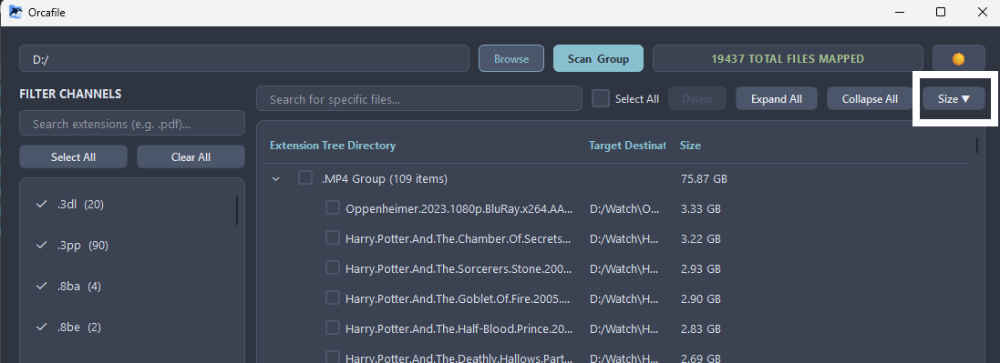
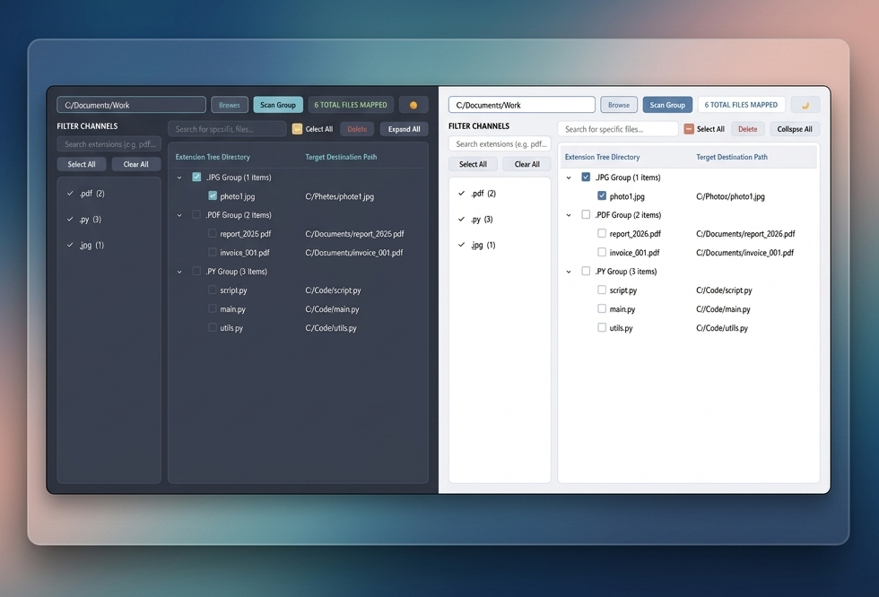

## 🎉 What's New in v1.0.2

- **File sorting based on size**: Now sort your files based on their sizes in the orcafile UI, and delete unwanted large files.



## 🎉 What's New in v1.0.1

- **Dark / Light Theme Toggle**: Seamlessly switch between the original Nord dark theme and a brand new light theme. Your preference is saved automatically!
- **File Selection & Bulk Deletion**: Select individual files or entire extension groups using checkboxes. Delete unwanted files directly from the application with a convenient confirmation dialog and success notifications.

<br>

<p align="center">
  
</p>

<h1 align="center">Orcafile</h1>

<p align="center">
  <b>A fast, lightweight desktop app that scans any folder or drive and instantly groups every file by its extension.</b>
</p>

<p align="center">
  
  
  
  
  
</p>


<p align="center">
  
</p>


## 📖 Table of Contents

- [Features](#-features)
- [Quick Start](#-quick-start)
  - [Option A — Run the Windows Installer](#option-a--run-the-windows-installer)
  - [Option B — Run from Source](#option-b--run-from-source)
- [How to Use](#-how-to-use)
  - [1. Select a Folder](#1-select-a-folder)
  - [2. Scan & Group](#2-scan--group)
  - [3. Filter by Extension](#3-filter-by-extension)
  - [4. Search for Files](#4-search-for-files)
  - [5. Open File Location](#5-open-file-location)
- [UI Controls](#-keyboard--ui-controls)
- [Contributing](#-contributing)
- [License](#-license)
- [Author](#-author)

---

## ✨ Features

| Feature | Description |
|---------|-------------|
| **⚡ Blazing-Fast Scan** | Multi-pass background scanner with real-time progress — handles 100k+ files without freezing the UI. |
| **📂 Extension Grouping** | Automatically groups every file by its extension (`.pdf`, `.jpg`, `.py`, etc.) into a collapsible tree view. |
| **🔍 Smart Extension Filter** | Accumulative search that isolates matching extensions while remembering your previous selections. |
| **🔎 File Name Search** | Instantly filter the tree view by file name to locate specific files within groups. |
| **📁 Open in Explorer** | Double-click any file to reveal it in your native file manager (Explorer, Finder, or your Linux file manager). |
| **🛑 Cancel Anytime** | Stop a running scan mid-way without losing already-indexed data. |
| **🎨 Nord Theme** | Beautiful dark UI built on the [Nord color palette](https://www.nordtheme.com/) — easy on the eyes during long sessions. |
| **💻 Cross-Platform** | Runs on Windows, macOS, and Linux. |

---

## 🚀 Quick Start

### Option A — Run the Windows Installer

A pre-built installer is available at : [Release_1.0.0](https://github.com/shayansaha85/orcafile/releases/tag/orcafile_v1.0.0)

Run the installer and follow the setup wizard. It will install Orcafile to your Program Files (Can be changed) and optionally create a desktop shortcut.

### Option B — Run from Source

**Prerequisites:**
- Python 3.10 or higher
- pip (Python package manager)


**Steps:**

```bash
# 1. Clone the repository
git clone https://github.com/shayansaha85/orcafile.git
cd orcafile

# 2. (Recommended) Create a virtual environment
python -m venv venv

# Windows
venv\Scripts\activate

# macOS / Linux
source venv/bin/activate

# 3. Install dependencies
pip install PyQt6 Send2Trash

# 4. Launch the app
python orcafile_main.py
```

---

## 🎯 How to Use

### 1. Select a Folder

Click the **Browse** button in the top-left corner and select any folder or drive you want to scan. Alternatively, type or paste a path directly into the input field.

```
Examples:
  C:\Users\YourName\Documents
  D:\
  /home/yourname/projects
```

### 2. Scan & Group

Click the teal **Scan & Group** button to start indexing. You'll see:

1. **"CALCULATING TOTAL FILE COUNT..."** — the app counts all files in the directory tree.
2. **"SCANNING: 42% (1200/2857)"** — a progress bar and live percentage as files are indexed.
3. **"2857 TOTAL FILES MAPPED"** — the scan is complete.

The status bar in the top-right shows the current state at all times.

> **💡 Tip:** Need to stop a long scan? The button changes to a red **Stop Scan** button during scanning — click it to cancel at any time.

### 3. Filter by Extension

The **left sidebar** shows all discovered file extensions with file counts. You can:

| Action | How |
|--------|-----|
| **Toggle an extension** | Click the checkbox next to any extension to show/hide its files in the tree. |
| **Search extensions** | Type in the *"Search extensions"* field (e.g., `.pdf`) to filter the list. Matching extensions are automatically checked. |
| **Select All** | Click the **Select All** button to check every visible extension. |
| **Clear All** | Click the **Clear All** button to uncheck everything. |

> **💡 How Smart Search Works:**
> - **First search** — Unchecks everything, then checks only the matches. This isolates the extension you're looking for.
> - **Subsequent searches** — Remembers what was already checked and adds new matches on top. This lets you build up a custom selection across multiple searches.
> - **Clear the search bar** — All extensions become visible again (checked states are preserved).

### 4. Search for Files

The **right panel** has its own *"Search for specific files..."* search bar at the top. Type any part of a file name to instantly filter the tree view:

- Matching files remain visible; non-matching files are hidden.
- Empty groups are automatically collapsed.
- Groups with matches stay expanded for quick browsing.

### 5. Open File Location

**Double-click** any file entry in the tree view to open its containing folder in your operating system's file manager:

| OS | Behavior |
|----|----------|
| **Windows** | Opens Explorer with the file pre-selected. |
| **macOS** | Opens Finder with the file highlighted. |
| **Linux** | Opens the containing directory in your default file manager. |

---

## 🎮 UI Controls

| Control | Action |
|---------|--------|
| **Browse** button | Opens a native folder picker dialog. |
| **Scan & Group** button | Starts scanning (or stops if a scan is running). |
| **Select All** / **Clear All** | Bulk check/uncheck all visible extension filters. |
| **Expand All** / **Collapse All** | Expand or collapse all groups in the file tree. |
| **Double-click a file** | Opens the file's location in your native file manager. |
| **Splitter handle** | Drag the vertical divider between sidebar and tree to resize panels. |

---

## 🤝 Contributing

Contributions are welcome! Here's how to get started:

1. **Fork** the repository.
2. **Create a branch** for your feature or fix:
   ```bash
   git checkout -b feature/your-feature-name
   ```
3. **Make your changes** and test them.
4. **Commit** with a descriptive message:
   ```bash
   git commit -m "Add: brief description of your change"
   ```
5. **Push** to your fork and open a **Pull Request**.

---

## 📄 License

This project is licensed under the **GNU General Public License v3.0** — see the [LICENSE](LICENSE) file for details.
You are free to use, modify, and distribute this software under the terms of the GPLv3.


---

## 👤 Author

**Shayan Saha**

- GitHub: [@shayansaha85](https://github.com/shayansaha85)
- Twitter: [@shayansaha85](https://x.com/shayansaha85)

---

<p align="center">
  Made with ❤️ and PyQt6
</p>
